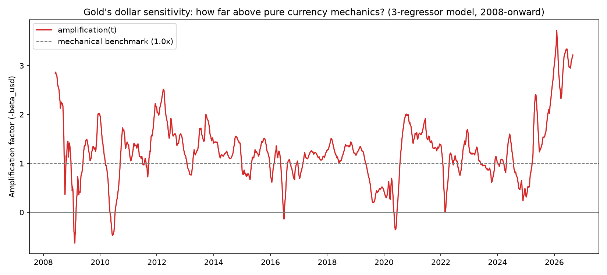

# gold-tvp-statespace

A time-varying-parameter (TVP) Bayesian state space model for gold's daily
directional sensitivity to real interest rates, the US dollar, and gold's
own options-implied volatility — built as a weekend deep-dive into Kalman
filtering, shrinkage priors, and honest backtesting that turned into an
ongoing forward-testing project. **This is an educational/exploratory
project, not a trading system or investment advice.**

## What this is

Gold's relationship to real rates and the dollar isn't fixed — it visibly
shifts across macro regimes (QE era vs. hiking cycle vs. now). Instead of
a single OLS coefficient averaged over 20 years, this project models
sensitivities as **time-varying parameters**: latent states that follow a
random walk through a Kalman filter, estimated via a custom
`statsmodels.tsa.statespace.mlemodel.MLEModel` subclass, with the random
walk variances themselves fit via full Bayesian inference (PyMC) using a
horseshoe shrinkage prior — so the model decides *for itself* whether a
given coefficient should genuinely move over time or behave like an
ordinary fixed regression coefficient.

Underneath the Bayesian machinery, don't lose sight of what this is: still
just linear regression (`gold_return = β₁·real_rate_change +
β₂·usd_change + β₃·gvz_change + ε`), just with the coefficients allowed
to wiggle instead of being pinned to one number for two decades.

## The model

```
gold_logret_t = b1_t*real_rate_diff_t + b2_t*usd_logret_t + b3_t*gvz_logret_t + eps_t
b1_t = b1_{t-1} + eta1_t   (random walk, eta1 ~ N(0, sigma2_beta1))
b2_t = b2_{t-1} + eta2_t   (random walk, eta2 ~ N(0, sigma2_beta2))
b3_t = b3_{t-1} + eta3_t   (random walk, eta3 ~ N(0, sigma2_beta3))
```

| Regressor | Source | Sign | Economic interpretation |
|---|---|---|---|
| `real_rate_diff` | FRED `DFII10` (10Y TIPS real yield, daily change) | Negative | Higher real rates raise the opportunity cost of holding non-yielding gold |
| `usd_logret` | FRED `DTWEXBGS` (trade-weighted USD index, log return) | Negative, and amplified | A stronger dollar mechanically compresses USD-priced gold (numeraire effect) -- but gold's beta here runs several times larger than pure currency mechanics would predict (see the amplification finding below), suggesting genuine risk-appetite/reserve-diversification content beyond arithmetic |
| `gvz_logret` | CBOE `^GVZ` (gold's own options-implied volatility, log return) | **Positive** | The opposite sign convention from equities' "leverage effect" (rising VIX -> falling stocks) -- gold is a safe-haven asset, so rising uncertainty about gold itself tends to coincide with gold being bid up, not sold off |

`^GVZ` only exists from 2008-06-04 onward. Every script that fits the
3-regressor model restricts training to that date forward on ALL
regressors, not just GVZ — `statsmodels` treats any `NaN` in the design
matrix as the WHOLE observation missing, so without this restriction,
real_rate and usd_logret would also get worse informational footing
during 2006-2008 in the GVZ-inclusive model than in a model without it.
Confirmed via direct testing that this restriction doesn't meaningfully
change results — it just removes a legitimate objection before trusting
them.

## Key findings

- **The shrinkage prior works.** On synthetic data with one genuinely
  time-varying coefficient and one genuinely fixed one, the horseshoe
  prior correctly separated them without any manual tuning.
- **A units confound nearly produced a false "this coefficient is all
  noise" conclusion.** Real rate changes have ~15x the standard deviation
  of USD log returns in this dataset; standardizing first was essential
  before comparing the two coefficients' innovation variances.
- **Adding TIPS breakevens (5Y/10Y) as extra regressors was tested and
  rejected.** A 4-regressor model showed a small directional accuracy
  improvement on the holdout (0.6852 → 0.6955), but McNemar's test found
  it statistically indistinguishable from chance (p=0.35), and the two
  breakeven durations showed the classic collinear-regressor symptom
  (unstable variance split between two highly correlated inputs).
- **Four more candidates were tested one at a time, same bar every time:
  a real McNemar-significant accuracy gain AND a nonzero sigma_beta
  role, neither alone sufficient** (`tvp_new_regressor_test.py`):

  | Candidate | McNemar p-value | sigma_beta role | Verdict |
  |---|---|---|---|
  | VIX (`vix_logret`) | 1.000 | comparable, but... | **Rejected** |
  | 2Y Treasury (`treasury_2y_diff`) | 0.525 | comparable, but... | **Rejected** |
  | 10Y-3mo curve slope | 0.918 | comparable, but... | **Rejected** |
  | **Gold Vol Index (`gvz_logret`)** | **0.0009** | **largest of all 3 betas** | **Accepted** |

  For the first three, sigma_beta alone would have said "include it" —
  McNemar is what actually distinguished real signal from in-sample
  noise that doesn't generalize. GVZ is the one candidate where both
  signals agreed, and it held up nearly identically (p=0.0009, same
  effect size) when re-tested with both models restricted to GVZ's
  actual 2008-06-04 inception, ruling out the missing-data confound as
  the explanation. **The model is now 3-regressor: real rate, USD, GVZ.**
- **The model's confidence is genuinely informative, and got MORE
  informative with GVZ added.** Bucketing forecasts by |z| = forecast /
  Kalman-predicted-std and checking realized hit rate per bucket: the
  2-regressor model climbed from ~57% to ~87% test-set hit rate across 5
  buckets; the 3-regressor model climbs from ~66% to ~89%, with the
  biggest gains at the top end (bucket 3: 71% → 81%, bucket 4: 87% →
  89%) — the buckets that actually drive most of the sizing.
- **Confidence-weighted half-Kelly sizing beat flat sizing at the same
  average exposure**, both before and after adding GVZ. 2-regressor
  holdout: 202.68% vs. 110.78% total return (long/short). 3-regressor,
  **long-only** (the version that actually matters, see below): 124.40%
  vs. flat sizing, Sharpe-like 5.84. The backtest's Sharpe-like ratios
  (~5-7 depending on variant) are implausibly high by real-world
  standards and should be read as "this specific holdout window was
  unusually favorable," not "this beats professional funds."
- **Long-only has a real, measurable cost, not just a theoretical one.**
  Removing shorting (to match a standard cash-account Roth IRA, which
  can't short) dropped the Sharpe-like ratio from 7.43 to 5.84 in the
  3-regressor model at the same Kelly fraction. Doesn't undercut the
  structural case against shorting (a short's loss is unbounded, a
  long's is capped at 100%) — it just means this backtest window never
  hit the scenario where that structural risk bites.
- **Manually excluding low-confidence buckets (0-1) from a long-only
  strategy made things WORSE, not better — confirmed twice, on two
  different models.** 2-regressor: 89.01% (all buckets) vs. 80.54%
  (bucket≥2 only). 3-regressor: 124.40% vs. 113.66%, same pattern. Kelly
  sizing already discounts weak-edge buckets correctly (a thin 58% edge
  gets an appropriately thin ~8-10% stake) — manually zeroing them out
  on top of that doesn't remove risk that wasn't already handled, it
  just throws away real, if modest, positive-expectancy bets. See
  `tvp_sizing_variants.py`.
- **A recurring bug pattern worth naming explicitly: hardcoded regressor
  names left over from the 2-regressor era.** Multiple times during the
  GVZ rollout, a script crashed or would have silently used stale values
  because a `params` array or beta printout referenced
  `SIGMA_BETA["real_rate_diff"]`/`["usd_logret"]` by name instead of
  looping over the current `REGRESSORS` list. Fixed by building these
  generically (`[SIGMA_BETA[r] for r in REGRESSORS]`) everywhere —
  worth checking for this specific pattern any time a new regressor
  gets added to any of these scripts.
- **Gold's dollar sensitivity was far above what pure currency mechanics
  would predict, in the 2-regressor model.** If gold's USD price moved
  purely because it's dollar-denominated (the "numeraire effect"),
  `beta_usd` should sit near -1 (a 1% dollar move -> ~1% opposite gold
  move, no story beyond currency translation). As of 2026-08-21, the
  fitted `beta_usd` was **-4.19** — about 4.2x the mechanical benchmark,
  at the 99.1st percentile of its own 20-year history (range -1.33x to
  5.03x; the negative low end means the relationship has, at least once,
  actually flipped — gold moving *with* the dollar, plausibly a shared
  flight-to-safety episode). See `tvp_dollar_amplification.py`.

  **This is a point-in-time snapshot, not a permanent structural fact,**
  and the underlying model changed since that reading — as of 2026-08-28,
  under the now-locked 3-regressor model (rerun, not anecdotal), the
  fitted `beta_usd` amplification is **3.22x**, over a 2008-2026 history
  (GVZ doesn't exist before 2008, so the 3-regressor version's history is
  necessarily shorter than the 2-regressor version's full 20 years):
  mean 1.24x, range -0.63x to 3.72x. Current reading sits at the **98.8th
  percentile** of that history — still near an extreme, genuinely lower
  than the 2-regressor model's 4.19x/99.1st-percentile reading, consistent
  with GVZ now absorbing some of what USD used to carry alone. Rerun
  `tvp_dollar_amplification.py` for a current number before trusting
  either figure as still true.

  

## Live forecasting

`DTWEXBGS` (the broad USD index) has a **structural ~1-week publication
lag** on FRED — it's a Fed H.10 statistical release, genuinely slower to
post than the other series, not a pipeline bug. `DFII10` (the real
yield) also lags by ~1 business day on any given day, for the mundane
reason that FRED hasn't finished its daily update yet. `GC=F` and `^GVZ`
have no such lag, but both get caught in the archive's trim alongside
the dollar anyway, since `fetch_gold_data.py` trims the WHOLE dataframe
to whatever the slowest CORE series has reached.

**`tvp_bridge_forecast.py` is retired.** Everything it did is now
superseded by `tvp_bridge_forecast_experiment.py`, which does the same
job plus the live A/B experiment described below. Don't use the old
script going forward.

### `tvp_bridge_forecast_experiment.py`

This runs TWO forecasts for the SAME target day (the next trading day
after the last genuinely closed session), sharing one Kalman filter
state, differing only in what fills in "what will today's inputs be":

- **EOD_TREND**: today's regressors assumed equal to their trailing
  15-day average. No new information about today at all — a pure
  extrapolation from the last completed close.
- **SINCE_LAST_CLOSE**: today's real_rate_diff/usd_logret computed from
  the ACTUAL move already visible in `^TNX` and `DX-Y.NYB` between
  yesterday's close and right now. `gvz_logret` still uses the trailing
  average in both — GVZ is priced from GLD options, which aren't open
  pre-market, so there's no real overnight GVZ reading to substitute.

This tests one specific, real question that a backtest structurally
*cannot* answer (every historical script always has complete, settled
data — there's no such thing as a partial day in the archive): does the
dollar/rate market's overnight move carry genuine information about
today's close, beyond what a trend-persists guess already captures?

**Real bugs found and fixed while building this, worth knowing about if
you're extending it further:**
- An earlier version filled the bridge days' gold return with a fake
  `0` instead of the real, already-known `GC=F` close for those already-
  completed sessions. `0` isn't "unknown" to a Kalman filter — it's an
  active claim that gold definitely didn't move, and the filter's
  update step would genuinely (and wrongly) correct beta based on that
  fiction. Fixed to pull real gold closes for the bridge window.
- An earlier version excluded "today's calendar date" unconditionally,
  regardless of what time it was run — meaning it stayed one day stale
  even hours after the market had genuinely closed. Fixed to check real
  Eastern time against each instrument's actual settlement window
  (`DX-Y.NYB` and `^TNX` both settle their daily bar around 2:59-3:00pm
  ET specifically, confirmed via ICE's own contract documentation and
  multiple quote sources for `^TNX` — not the 5pm guess used initially).
- The "what's the last closed day" logic originally used naive calendar
  arithmetic (`today - 1 day`), which breaks on Mondays (lands on
  Sunday, never a trading day) and on any market holiday. Fixed to
  derive the last closed day from the ACTUAL data returned, not a
  calendar rule — weekends and holidays are handled automatically since
  neither has real rows to find.

**Daily live workflow:**
```
python fetch_gold_data.py                      # refresh with whatever's real
python tvp_bridge_forecast_experiment.py       # get both forecasts, log both
```

None of this proxy/bridge data is ever written into `gold_macro_data.csv`
— every number is reconstructed fresh each run, so the archive stays
100% real.


## Files

| Script | What it does | Runtime |
|---|---|---|
| `fetch_gold_data.py` | Pulls DFII10, DTWEXBGS (FRED), gold futures, VIX, GVZ (yfinance), aligns and cleans, computes log returns/diffs | seconds |
| `tvp_gold_model.py` | Defines the custom `TVPRegression` `MLEModel`; MLE point-estimate baseline fit + diagnostic plot | seconds |
| `diagnose_tvp_betas.py` | Delta/correlation diagnostics on MLE beta paths (catches noise-chasing, variance-trading) | seconds |
| `tvp_bayes_shrinkage.py` | Library: horseshoe-shrinkage Bayes model (PyMC), reusable fit/forecast functions | ~15-20 min |
| `tvp_holdout_backtest.py` | 80/20 train/test split, MLE vs. Bayes directional accuracy on genuinely held-out data | ~20-25 min |
| `tvp_regressor_comparison.py` | 2-regressor vs. 4-regressor (with breakevens) comparison + McNemar's test | ~40-50 min |
| `tvp_breakeven_diagnostic.py` | Delta-correlation check on the two breakeven betas specifically | ~18 min |
| `tvp_calibration.py` | Confidence-bucket calibration curve (does model confidence predict accuracy?) | ~18 min |
| `tvp_position_sizing.py` | Half-Kelly position sizing backtest vs. flat sizing vs. buy-and-hold | ~18 min |
| `tvp_sizing_variants.py` | Half vs. quarter Kelly, long-only vs. long/short, bucket>=2-only vs. all buckets, plus a buy-and-hold benchmark | seconds |
| `tvp_new_regressor_test.py` | Tests ONE new candidate regressor at a time against the locked baseline: McNemar's test + sigma_beta check. Change `NEW_REGRESSOR` and rerun for each candidate | ~40-50 min |
| `tvp_dollar_amplification.py` | Gold's USD-sensitivity vs. the mechanical -1 currency-pass-through benchmark, full history + current percentile rank (3-regressor model, 2008-2026) | seconds |
| `tvp_forward_prediction.py` | Scenario-conditional next-day (and rough monthly) prediction using the locked model, off the archived (lagged) dataset | seconds |
| `tvp_bridge_forecast_experiment.py` | **Current live workflow.** EOD_TREND vs. SINCE_LAST_CLOSE, same target day, shared beta -- see "Live forecasting" above | seconds |
| `tvp_grade_latest.py` | Pulls real, fresh gold prices (yfinance) to grade recent forecast calls without waiting on FRED | seconds |

`tvp_bridge_forecast.py` is retired — see "Live forecasting" above.

All the PyMC-fitting scripts wrap a black-box Kalman filter likelihood
from `tvp_gold_model.py`/`tvp_bayes_shrinkage.py` as a PyTensor `Op`
(using `statsmodels`' own `score()` for the gradient), which is why
they're slow relative to a native PyMC model — every NUTS step still
runs a full Kalman filter pass. Ran comfortably on an M4 Mac mini;
budget accordingly on slower hardware.

## Requirements

```
pip install fredapi yfinance pandas numpy statsmodels matplotlib pymc arviz
```

Needs a free FRED API key (`FRED_API_KEY` env var) — see
`fetch_gold_data.py` for details.